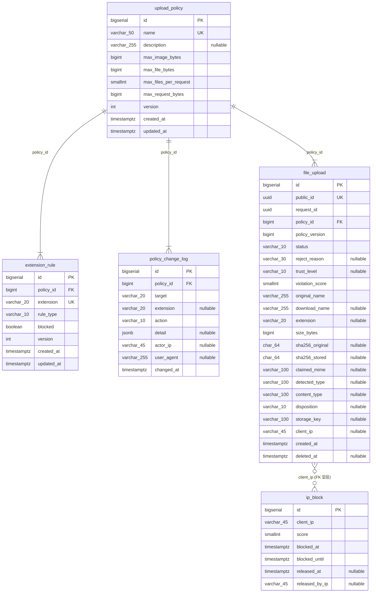

# ERD

실행 중인 PostgreSQL(`fileupload-db`, localhost:55432)의 카탈로그를 2026-10-01에 조회해 생성했다.
스키마 기준은 `schema.sql`이며, DB에 ENUM 타입·뷰·트리거는 없고 코드 값은 전부 VARCHAR + CHECK로 강제한다.

그림으로 보려면 [erd.png](erd.png)를 열면 된다. 확대해서 볼 때는 [erd.svg](erd.svg)가 선명하다.
그림과 아래 Mermaid는 `scripts/generate-erd.js`가 만든다.

```
node scripts/generate-erd.js
```

## 관계

| 자식 | FK 컬럼 | 부모 | ON DELETE / UPDATE | 비고 |
|---|---|---|---|---|
| `extension_rule` | `policy_id` NOT NULL | `upload_policy.id` | NO ACTION | `UNIQUE (policy_id, extension)` |
| `policy_change_log` | `policy_id` NOT NULL | `upload_policy.id` | NO ACTION | append-only, `id` 가 곧 정책 버전 |
| `file_upload` | `policy_id` NOT NULL | `upload_policy.id` | NO ACTION | `policy_version` 은 숫자만 보관, FK 없음 |
| `ip_block` | 없음 | 없음 | 해당 없음 | `client_ip` 문자열로 `file_upload` 와 조인 |

## 설계 메모

- 신뢰 목록(허용 형식)은 DB가 아니라 Java enum `TrustedFileType`이 관리한다. DB는 차단 목록만 가진다.
- `policy_change_log.extension`, `file_upload.extension`은 `extension_rule`에 FK를 걸지 않는다. 커스텀 확장자를 hard delete해도 이력이 남아야 하기 때문.
- `ip_block`은 FK가 없고 `client_ip` 문자열로만 `file_upload`와 연결된다.
- FK 3개 모두 ON DELETE NO ACTION이라 자식 행이 남은 정책은 삭제할 수 없다.
- `updated_at`·`version` 증가는 JPA가 담당한다. DB 트리거는 없다.

## Mermaid

<!-- mermaid:start -->

<!-- mermaid:end -->
